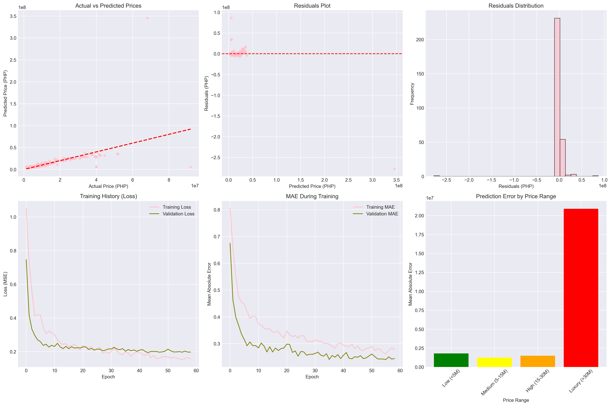

# Philippine Property Price Prediction Neural Network


A comprehensive deep learning project for predicting property prices in the Philippines using neural networks. This project implements a sophisticated machine learning pipeline that analyzes real estate data to provide accurate property valuations.

## Project Overview

### Objective
Create an intelligent neural network model that predicts property prices in the Philippines using:
- **Property Features**: Bedrooms, bathrooms, floor area, land area
- **Geographic Data**: Latitude, longitude, distance from major cities
- **Property Types**: Condos, houses, townhouses, studios, offices
- **Location Intelligence**: Cities, provinces, regions

### Architecture
- **Framework**: TensorFlow/Keras
- **Input**: Mixed data types (numerical, categorical, geographic)
- **Output**: Continuous price prediction (PHP)
- **Network**: Multi-layer deep neural network with embedding layers

### Model Performance
- **R² Score**: -1.1903 (needs improvement)
- **MAPE**: 24.65% (Mean Absolute Percentage Error)
- **MAE**: ₱3,502,892
- **RMSE**: ₱17,628,260
- **Model Parameters**: 23,117
- **Use Cases**: Real estate valuation, investment analysis, market research

## Quick Start

### Prerequisites
- Python 3.8 or higher
- 8GB+ RAM (16GB recommended)
- NVIDIA GPU

### Installation

1. **Clone the repository**
   ```bash
   git clone <repository-url>
   cd Philippine-Property-Prediction-NN
   ```

2. **Create virtual environment**
   ```bash
   python -m venv property_prediction_env
   
   # Activate on Windows
   property_prediction_env\Scripts\activate
   
   # Activate on macOS/Linux
   source property_prediction_env/bin/activate
   ```

3. **Install dependencies**
   ```bash
   pip install -r requirements.txt
   ```

4. **Run the project**
   ```bash
   # Full pipeline (recommended) - from project root
   python main.py
   # OR
   python src/main.py
   
   # Quick demo (faster, reduced training)
   python main.py demo
   # OR
   python src/main.py demo
   ```

## Usage Guide

### Basic Usage

```python
from src.property_price_prediction import *
from src.evaluation_and_deployment import PropertyPricePredictor

# Load and train model
df = load_and_explore_data('data/PH_houses_v2.csv')
df_clean = clean_and_preprocess_data(df)
X, y, feature_names, categorical_features, numerical_features = prepare_features_for_model(df_clean)

# Create and train neural network
model = create_neural_network(
    input_dim=X.shape[1],
    categorical_features=categorical_features,
    numerical_features=numerical_features
)

trained_model, history = train_neural_network(
    model, X_train, y_train, X_val, y_val
)

# Make predictions
predictor = PropertyPricePredictor(model=trained_model)
predicted_price = predictor.predict_price({
    'bedrooms': 2,
    'bath': 2,
    'floor_area': 85,
    'latitude': 14.5888,
    'longitude': 121.0790,
    'property_type': 'Condo'
})
```


## Technical Details

### Data Preprocessing
- Handle missing values ('na' strings - 78.1% missing in Land_area)
- Extract property types from descriptions
- Calculate distances from major cities (Manila, Cebu, Davao)
- Create derived features (Floor_Area_per_Bedroom, Total_Rooms)
- Label encoding and embedding layers for categorical features

### Neural Network Architecture

```
Input Layer (Mixed Types)
├── Numerical Features (Dense Input)
├── Categorical Features (Embedding Layers)
│   ├── Property Type Embedding
│   ├── Location Embedding
│   └── Region Embedding
└── Geographic Features (Dense Input)

Hidden Layers
├── Dense Layer 1 (128 neurons, ReLU, Dropout 0.4)
├── Dense Layer 2 (64 neurons, ReLU, Dropout 0.3)
├── Dense Layer 3 (32 neurons, ReLU, Dropout 0.2)
└── Output Layer (1 neuron, Linear)
```

### Training Configuration
- **Optimizer**: Adam (initial learning_rate=0.001)
- **Loss Function**: Mean Squared Error (MSE)
- **Batch Size**: 32
- **Epochs**: 100 (early stopping at epoch 44)
- **Early Stopping**: Patience=15, restore_best_weights=True
- **Learning Rate Schedule**: ReduceLROnPlateau (factor=0.5)

## Performance Metrics

### Actual Model Performance
- **Mean Absolute Error (MAE)**: ₱3,502,892
- **Root Mean Squared Error (RMSE)**: ₱17,628,260
- **R² Score**: -1.1903
- **Mean Absolute Percentage Error (MAPE)**: 24.65%

### Top 10 Most Important Features
1. Floor_Area_per_Bedroom (0.506)
2. Floor_area (sqm) (0.389)
3. City (0.165)
4. Has_Land_Area (0.146)
5. Land_area (sqm) (0.116)
6. Bath (0.103)
7. Dist_Manila (0.102)
8. Total_Rooms (0.101)
9. Is_Pre_Selling (0.070)
10. Latitude (0.070)

### Recommendations
- Model performance needs improvement (negative R² indicates poor fit)
- Focus on improving predictions for properties with higher errors
- Consider collecting more data for underrepresented property types
- Investigate feature engineering and model architecture improvements

## Deployment

The trained model is saved as:
- `models/property_price_model_nn.h5` - Trained neural network
- `models/property_price_model_preprocessing.pkl` - Preprocessing objects

```python
from src.evaluation_and_deployment import PropertyPricePredictor

predictor = PropertyPricePredictor()
predictor.load_model('models/property_price_model')
price = predictor.predict_price(property_data)
```

## Visualization

The model generates comprehensive evaluation visualizations saved to `output/Figure_1.png`:



The dashboard includes:
- Actual vs Predicted Prices scatter plot
- Residuals analysis and distribution
- Training history (Loss and MAE)
- Prediction error by price range

**Key Insights:**
- Model performs best for properties in low to medium price ranges
- Errors increase with property value (heteroscedasticity)
- Training convergence is stable with early stopping at epoch 44


## License

This project is licensed under the MIT License - see the [LICENSE](LICENSE) file for details.

## Acknowledgments

- Dataset source: Philippine real estate listings
- Framework: TensorFlow/Keras team
- Community: Open source contributors


---


*Last Updated: November 2025*